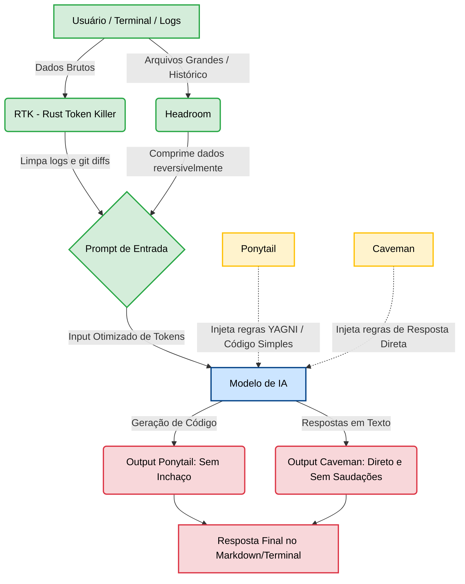

# "Pilha de otimização" para agentes de IA

## Headroom, RTK, Ponytail e Caveman

- 
Essas ferramentas e técnicas funcionam em conjunto como uma "pilha de otimização" para agentes de IA (como o Claude Code), focadas em cortar excessos e economizar tokens em diferentes etapas da interação. Cada uma atua em um ponto específico do processo de Input (entrada) e Output (saída).Para compreender o fluxo de ponta a ponta: o usuário faz uma pergunta, a IA lê o histórico e as ferramentas (Input), e depois gera uma resposta (Output).

### Headroom

- 
O Headroom atua no Input. Ele funciona como uma camada de compressão inteligente e reversível que fica entre a sua aplicação (ou terminal) e a API da IA.Como funciona: Quando o agente precisa ler logs gigantescos, resultados de banco de dados ou arquivos históricos, o Headroom comprime esse conteúdo. Ele usa técnicas avançadas de compactação para remover redundâncias e ruídos sem perder a essência dos dados, o que gera uma economia de até 60% a 95% dos tokens.Reversibilidade: A carta na manga do Headroom é que a compressão é "reversível". Ele guarda o texto original com um hash e, caso o modelo precise de algum detalhe minucioso, é possível restaurar o dado original perfeitamente.

### RTK (Rust Token Killer)

- 
O RTK atua diretamente no Input gerado pelas suas ferramentas e terminal.Como funciona: Durante o desenvolvimento, comandos comuns de terminal ou de análise de código (stdout/stderr, git diff) costumam gerar uma enorme quantidade de "barulho" e linhas repetitivas. O RTK intercepta esses fluxos e os limpa, transformando tabelas longas ou logs extensos em resumos compactados, tokenizando e filtrando os dados antes que eles sejam enviados para a IA.Impacto: O RTK otimiza especialmente o consumo de tokens na leitura do ambiente.

### Ponytail

- 
O Ponytail atua no nível de código e lógica do agente.Como funciona: Ele injeta regras de "programador preguiçoso" (estilo YAGNI — You Aren't Gonna Need It) no prompt do sistema. A IA é instruída a escrever o código mais curto, simples e funcional possível, priorizando usar bibliotecas nativas e one-liners em vez de criar novas estruturas complexas desnecessariamente.Impacto no Output: Como resultado dessa instrução, a IA gera menos código inchado e menos abstrações desnecessárias, o que reduz naturalmente o tamanho do Output.

### Caveman (Modo Homem das Cavernas)

- 
O Caveman atua no Output. É uma diretriz comportamental (ou prompt) que muda como a IA responde.Como funciona: Ele instrui a IA a eliminar palavras de preenchimento, saudações educadas, introduções e transições. A IA responde estritamente com o conteúdo essencial, em trechos curtos.Exemplo prático: Em vez de a IA dizer "Você pode usar um comando para listar os arquivos...", o Caveman a força a responder apenas "ls -la". Isso corta a emissão de texto excessivo pela metade.A combinação dessas soluções cria um ecossistema muito mais eficiente. Ferramentas como o Headroom tratam de otimizar o que você envia, enquanto abordagens de prompt do tipo Caveman e Ponytail controlam o tamanho da resposta.

### Fluxo de otimização

